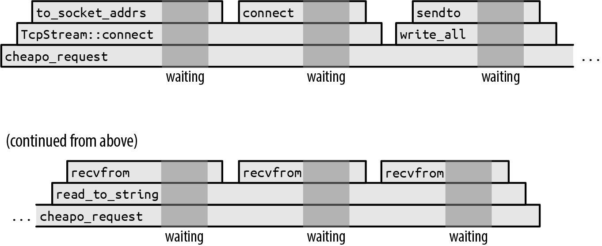

# Chapter 20. Asynchronous Programming 异步编程
> Suppose you’re writing a chat server. For each network connection, there are incoming packets to parse, outgoing packets to assemble, security parameters to manage, chat group subscriptions to track, and so on. Managing all this for many connections simultaneously is going to take some organization.

假设你正在开发一个聊天服务器。对于每一个网络连接，都需要解析传入的数据包并组装传出的数据包，还有安全验证需要处理，聊天组群订阅需要跟踪，等等。同时为许多连接处理这些功能，需要一些架构。

> Ideally, you could just start a separate thread for each incoming connection:

理想情况下，你可以对每一个连接开启一个独立的线程：

```rust
use std::{net, thread};

let listener = net::TcpListener::bind(address)?;

for socket_result in listener.incoming() {
    let socket = socket_result?;
    let groups = chat_group_table.clone();
    thread::spawn(|| {
        log_error(serve(socket, groups));
    });
}
```

> For each new connection, this spawns a fresh thread running the serve function, which is able to focus on managing a single connection’s needs.

对于每一个新的线程，都会产生一个新的线程运行 serve 函数, 它能够专注于处理单个连接的需求。

> This works well, until everything goes much better than planned and suddenly you have tens of thousands of users. It’s not unusual for a thread’s stack to grow to 100 KiB or more, and that is probably not how you want to spend gigabytes of server memory. Threads are good and necessary for distributing work across multiple processors, but their memory demands are such that we often need complementary ways, used together with threads, to break the work down.

这很好，直到一切都比计划的要好得多，你突然有了成千上万的用户。一个线程的堆栈增长到100KiB或更多是很正常的，这可能不是你想要花费数千字节的服务器内存的方式。线程对于在多个处理器之间分配工作是很好的，也是必要的，但是它们的内存需求是这样的：我们经常需要补充的方法，与线程一起使用，以分解工作。

> You can use Rust asynchronous tasks to interleave many independent activities on a single thread or a pool of worker threads. Asynchronous tasks are similar to threads, but are much quicker to create, pass control amongst themselves more efficiently, and have memory overhead an order of magnitude less than that of a thread. It is perfectly feasible to have hundreds of thousands of asynchronous tasks running simultaneously in a single program. Of course, your application may still be limited by other factors like network bandwidth, database speed, computation, or the work’s inherent memory requirements, but the memory overhead inherent in the use of tasks is much less significant than that of threads.

你可以使用Rust异步任务，在单个线程或工作线程池上交织许多独立活动。异步任务类似于线程，但创建速度更快，在它们之间更有效地传递控制，并且内存开销比线程要小一个数量级。在一个程序中同时运行数十万个异步任务是完全可行的。当然，你的应用程序仍然可能受到其他因素的限制，如网络带宽、数据库速度、计算或工作固有的内存要求，但使用任务所固有的内存开销要比线程的开销小很多。

> Generally, asynchronous Rust code looks very much like ordinary multithreaded code, except that operations that might block, like I/O or acquiring mutexes, need to be handled a bit differently. Treating these specially gives Rust more information about how your code will behave, which is what makes the improved performance possible. The asynchronous version of the previous code looks like this:

一般来说，异步的Rust代码看起来很像普通的多线程代码，只是可能会阻塞的操作，如I/O或获取互斥，需要以不同的方式处理。对这些进行特殊处理，可以让Rust获得更多关于你的代码将如何表现的信息，这也是提高性能的原因。之前代码的异步版本看起来是这样的。

```rust
use async_std::{net, task};

let listener = net::TcpListener::bind(address).await?;

let mut new_connections = listener.incoming();
while let Some(socket_result) = new_connections.next().await {
    let socket = socket_result?;
    let groups = chat_group_table.clone();
    task::spawn(async {
        log_error(serve(socket, groups).await);
    });
}
```

> This uses the async_std crate’s networking and task modules and adds .await after the calls that may block. But the overall structure is the same as the thread-based version.

这使用了async_std crate的网络和任务模块，并在可能阻塞的调用后添加.await。但整体结构与基于线程的版本是一样的。

> The goal of this chapter is not only to help you write asynchronous code, but also to show how it works in enough detail that you can anticipate how it will perform in your applications and see where it can be most valuable.

本章的目标不仅是帮助你编写异步代码，而且要足够详细地展示它是如何工作的，你可以预测它在你的应用程序中的表现，并看到它在哪些方面可以发挥最大的价值。

> - To show the mechanics of asynchronous programming, we lay out a minimal set of language features that covers all the core concepts: futures, asynchronous functions, await expressions, tasks, and the block_on and spawn_local executors.
>
> - Then we present asynchronous blocks and the spawn executor. These are essential to getting real work done, but conceptually, they’re just variants on the features we just mentioned. In the process, we point out a few issues you’re likely to encounter that are unique to asynchronous programming and explain how to handle them.
>
> - To show all these pieces working together, we walk through the complete code for a chat server and client, of which the preceding code fragment is a part.
> 
> - To illustrate how primitive futures and executors work, we present simple but functional implementations of spawn_blocking and block_on.
>
> - Finally, we explain the Pin type, which appears from time to time in asynchronous interfaces to ensure that asynchronous function and block futures are used safely.

- 为了展示异步编程的机制，我们列出了一套最小的语言特性，涵盖了所有的核心概念：期货、异步函数、等待表达式、任务以及block_on和spwn_local执行器。

- 然后我们介绍了异步块和spawn执行器。这些对于完成真正的工作至关重要，但从概念上讲，它们只是我们刚才提到的功能的变种。在这个过程中，我们指出了一些你可能会遇到的异步编程所特有的问题，并解释了如何处理它们。

- 为了展示所有这些部分在一起工作，我们走过了一个聊天服务器和客户端的完整代码，前面的代码片段是其中的一部分。

- 为了说明原始的期货和执行器是如何工作的，我们介绍了简单但实用的spawn_blocking和block_on的实现。

- 最后，我们解释了Pin类型，它不时地出现在异步接口中，以确保异步函数和块期货的安全使用。

## From Synchronous to Asynchronous 从同步到异步

> Consider what happens when you call the following (not async, completely traditional) function:

从同步到异步考虑一下，当你调用以下（不是异步，完全是传统的）函数时会发生什么。

```rust
use std::io::prelude::*;
use std::net;

fn cheapo_request(host: &str, port: u16, path: &str)
                      -> std::io::Result<String>
{
    let mut socket = net::TcpStream::connect((host, port))?;

    let request = format!("GET {} HTTP/1.1\r\nHost: {}\r\n\r\n", path, host);
    socket.write_all(request.as_bytes())?;
    socket.shutdown(net::Shutdown::Write)?;

    let mut response = String::new();
    socket.read_to_string(&mut response)?;

    Ok(response)
}
```

> This opens a TCP connection to a web server, sends it a bare-bones HTTP request in an outdated protocol,1 and then reads the response. Figure 20-1 shows this function’s execution over time.

这个函数打开了一个与网络服务器的TCP连接，以过时的协议1向其发送一个简单的HTTP请求，然后读取响应。图20-1显示了这个函数在一段时间内的执行情况。

> This diagram shows how the function call stack behaves as time runs from left to right. Each function call is a box, placed atop its caller. Obviously, the cheapo_request function runs throughout the entire execution. It calls functions from the Rust standard library like TcpStream::connect and TcpStream’s implementations of write_all and read_to_string. These call other functions in turn, but eventually the program makes system calls, requests to the operating system to actually get something done, like open a TCP connection, or read or write some data.

这张图显示了当时间从左到右运行时，函数调用堆栈的行为方式。每个函数调用是一个盒子，放在其调用者的上面。很明显，cheapo_request函数贯穿了整个执行过程。它调用了Rust标准库中的函数，如TcpStream::connect和TcpStream的write_all和read_to_string的实现。这些函数依次调用其他函数，但最终程序会进行系统调用，向操作系统发出请求，以实际完成一些事情，比如打开一个TCP连接，或者读、写一些数据。



> The darker gray backgrounds mark the times when the program is waiting for the operating system to finish the system call. We didn’t draw these times to scale. If we had, the entire diagram would be darker gray: in practice, this function spends almost all of its time waiting for the operating system. The execution of the preceding code would be narrow slivers between the system calls.

较深的灰色背景标志着程序在等待操作系统完成系统调用的时间。我们没有按比例绘制这些时间。如果我们画了，整个图就会变成深灰色：在实践中，这个函数几乎所有的时间都在等待操作系统。前面的代码的执行将是在系统调用之间的狭长的片段。

> While this function is waiting for the system calls to return, its single thread is blocked: it can’t do anything else until the system call finishes. It’s not unusual for a thread’s stack to be tens or hundreds of kilobytes in size, so if this were a fragment of some larger system, with many threads working away at similar jobs, locking down those threads’ resources to do nothing but wait could become quite expensive.

当这个函数在等待系统调用返回时，它的单线程被封锁了：在系统调用完成之前，它不能做其他事情。一个线程的堆栈有几十或几百KB大小是很正常的，所以如果这是一个更大的系统的片段，有许多线程在做类似的工作，锁定这些线程的资源，除了等待什么都不做，可能会变得相当昂贵。

> To get around this, a thread needs to be able to take up other work while it waits for system calls to complete. But it’s not obvious how to accomplish this. For example, the signature of the function we’re using to read the response from the socket is:

为了解决这个问题，一个线程需要在等待系统调用完成的时候能够承担其他工作。但如何实现这一点并不明显。例如，我们用来从套接字中读取响应的函数的签名是。

```rust
fn read_to_string(&mut self, buf: &mut String) -> std::io::Result<usize>;
```

> It’s written right into the type: this function doesn’t return until the job is done, or something goes wrong. This function is synchronous: the caller resumes when the operation is complete. If we want to use our thread for other things while the operating system does its work, we’re going need a new I/O library that provides an asynchronous version of this function.

它被直接写进了类型中：这个函数在工作完成之前不会返回，或者出了问题。这个函数是同步的：当操作完成后，调用者会继续工作。如果我们想在操作系统工作时使用我们的线程做其他事情，我们将需要一个新的I/O库，提供这个函数的异步版本。